```{=html}
<style type="text/css">
body, td { font-size: 18px; }
code.r{ font-size: 18px; }
pre { font-size: 16px }
h1{ font-size: 28pt; }
h2{ font-size: 24pt; }
h3{ font-size: 20pt; }
h4{ font-size: 16pt; }
</style>
```
# Première Partie : Ingénierie des Données et Modélisation (Informatique)

La réussite de ce projet reposait sur la capacité à transformer une masse de fichiers CSV disparates en une structure relationnelle cohérente. Cette étape a représenté 60 % du temps de travail en raison de la complexité de l'harmonisation des données.

# Diagramme d'activité du projet

<center>
{width=85%}
</center>

# 1.1 Architecture Relationnelle et Schéma de la Base
Nous avons déployé une base de données SQLite3 structurée pour garantir l'intégrité référentielle. Le pivot de toute la base est le code_insee_com (standard officiel de l'INSEE).
## A. Table Données_geo (Le Référentiel Climatique)
Cette table sert de base géographique. Elle contient les coordonnées et les médianes climatiques.

Clé Primaire (PRIMARY KEY) : code_insee_com. Elle garantit l'unicité de chaque commune.

Requête SQL de création :
```sql
CREATE TABLE IF NOT EXISTS Données_geo (
    code_insee_com TEXT PRIMARY KEY, 
    nom_com TEXT, 
    reg_code INTEGER, 
    reg_nom TEXT,
    dep_code INTEGER, 
    dep_nom TEXT, 
    population INTEGER, 
    superficie REAL,
    densite REAL, 
    latitude REAL, 
    longitude REAL, 
    densite_cat TEXT,
    altitude_med REAL, 
    RR_med REAL, 
    NBJRR1_med REAL, 
    NBJRR5_med REAL,
    NBJRR10_med REAL, 
    Tmin_med REAL, 
    Tmax_med REAL, 
    Tens_vap_med REAL,
    Force_vent_med REAL, 
    Insolation_med REAL, 
    Rayonnement_med REAL
);
```
## B. Table Socio_Eco (Indicateurs de Richesse)
Cette table stocke les revenus médians. Nous avons dû mapper les noms de colonnes complexes du CSV vers des types SQL REAL.

Clé Primaire : code_insee_com.

Requête SQL de création :

```sql
CREATE TABLE IF NOT EXISTS Socio_Eco (
    code_insee_com TEXT PRIMARY KEY,
    nom_com TEXT,
    MED21 REAL,         -- Revenu médian 2021
    population REAL     -- Population municipale 2023
);

```
## C. Table Pollution (Mesures Journalières)
C'est la table la plus volumineuse, stockant l'historique des relevés.

Clé Primaire : id_mesure (Auto-incrémentée).

Clé Étrangère (FOREIGN KEY) : code_insee_com. Elle permet de lier chaque mesure aux caractéristiques géo-climatiques de la table mère.

Requête SQL de création :

```sql
CREATE TABLE IF NOT EXISTS Pollution (
    id_mesure INTEGER PRIMARY KEY AUTOINCREMENT,
    nom_dept TEXT,
    nom_com TEXT,
    code_insee_com TEXT,
    nom_station TEXT,
    code_station TEXT,
    typologie TEXT,
    influence TEXT,
    nom_poll TEXT,
    valeur_poll REAL,
    jour INTEGER,
    mois INTEGER,
    annee INTEGER
);

```
# 1.2 Résolution des Contraintes Techniques et Gestion des Anomalies

## 1. Le problème de l'encodage "BOM"
Les fichiers CSV présentaient des caractères parasites au début du fichier, empêchant la lecture de la première colonne (code_insee_com).
Solution : Utilisation de l'argument encoding='utf-8-sig' dans le script Python pour ignorer l'en-tête invisible généré par Excel.

## 2. Doublons et Intégrité Référentielle
Certains fichiers sources contenaient des doublons de communes.
Solution : En définissant code_insee_com comme PRIMARY KEY, nous avons utilisé le mécanisme d'erreur de SQLite pour identifier les doublons dans le script Python et nettoyer le dataset avant la fusion finale.

## 3. Agrégation pour l'analyse statistique
Faire des statistiques bivariées sur des milliers de lignes journalières aurait produit un "bruit" illisible.
Solution : Nous avons effectué un calcul de moyenne via AVG() directement en SQL avant l'export vers R, réduisant la table à un format "1 ligne = 1 commune/polluant".

# 1.3 Requête d'Extraction Finale (La Fusion)
Voici la requête complexe qui a permis de créer le fichier Donnees_Pour_R.csv en joignant les trois tables :
```sql
SELECT 
    P.code_insee_com, 
    G.nom_com as nom_commune, 
    P.nom_poll, 
    AVG(P.valeur_poll) as valeur_poll, 
    G.population, 
    G.Force_vent_med, 
    G.Tmax_med,
    S.MED21 as revenu_median
FROM Pollution P
JOIN Données_geo G ON P.code_insee_com = G.code_insee_com
JOIN Socio_Eco S ON P.code_insee_com = S.code_insee_com
GROUP BY P.code_insee_com, P.nom_poll;
```
# Deuxième Partie : Étude Statistique Descriptive
Cette section est consacrée à l'exploitation statistique des données. Nous cherchons à isoler les facteurs (économiques, démographiques ou climatiques) qui influencent la qualité de l'air en Occitanie.
```{r setup, include=FALSE}

# CONFIGURATION INITIALE 
# Chargement des bibliothèques nécessaires au projet
knitr::opts_chunk$set(echo = TRUE, warning = FALSE, message = FALSE)
library(ggplot2)
library(dplyr)
```

## 2.1 Initialisation et Préparation des Données
Nous commençons par charger le dataset enrichi et par convertir les variables numériques pour garantir la validité des calculs de corrélation.
```{r}
# Importation du jeu de données final (140 communes)
Stat_uni <- read.csv("Donnees_Pour_R.csv", header = TRUE, sep = ",", encoding = "UTF-8")

# Conversion des colonnes en format numérique pour les calculs
Stat_uni$revenu_median <- as.numeric(as.character(Stat_uni$revenu_median))
Stat_uni$valeur_poll   <- as.numeric(as.character(Stat_uni$valeur_poll))
Stat_uni$Force_vent_med <- as.numeric(as.character(Stat_uni$Force_vent_med))
Stat_uni$population    <- as.numeric(as.character(Stat_uni$population))
Stat_uni$Tmax_med      <- as.numeric(as.character(Stat_uni$Tmax_med))

# Vérification du chargement
print(paste("Nombre de lignes chargées :", nrow(Stat_uni)))

```


## 2.2 Analyse Univariée : Répartition des polluants

Nous étudions d'abord la répartition des polluants dans notre échantillon de communes.

```{r}
# GRAPHIQUE 1 : RÉPARTITION DES POLLUANTS
ggplot(Stat_uni, aes(x = nom_poll, fill = nom_poll)) +
  geom_bar() +
  scale_fill_brewer(palette = "Set3") + 
  labs(title = "Répartition des mesures par type de polluant",
       x = "Type de polluant",
       y = "Nombre de communes") +
  theme_minimal() +
  theme(legend.position = "none")

```


Commentaire : On observe une répartition équilibrée entre les différents polluants (O3, NO2, PM10), ce qui permet d'aborder sereinement les analyses bivariées suivantes.


# 2.3 Problématique 1 : Influence du niveau de vie sur la pollution

## Question : La richesse d'une commune impacte-t-elle la concentration moyenne de polluants ?

```{r}
#  PROBLÉMATIQUE 1 : RELATION REVENU MÉDIAN / POLLUTION 

# Nettoyage des données manquantes (NA)
Stat_clean_riche <- Stat_uni %>% 
  filter(!is.na(revenu_median), !is.na(valeur_poll))

# Visualisation par polluant (Faceting)
ggplot(Stat_clean_riche, aes(x = revenu_median, y = valeur_poll, color = nom_poll)) +
  geom_point(alpha = 0.7) +
  geom_smooth(method = "lm", color = "black", linetype = "dashed", size = 0.5, se = FALSE) +
  facet_wrap(~nom_poll, scales = "free_y") +
  labs(title = "Analyse de la pollution selon le revenu médian",
       x = "Revenu Médian annuel (€)",
       y = "Concentration moyenne (µg/m³)") +
  theme_bw() +
  theme(legend.position = "none")

# Calcul statistique du coefficient de corrélation
cor_riche <- cor(Stat_clean_riche$revenu_median, Stat_clean_riche$valeur_poll)
cat("Coefficient de corrélation de Pearson (Richesse/Pollution) :", round(cor_riche, 4))
```

Analyse : Le coefficient de corrélation est très faible (r round(cor_riche, 4)), ce qui indique une absence de lien linéaire fort entre le niveau de richesse et la pollution moyenne dans notre échantillon.

# 2.4 Problématique 2 : Impact de la force du vent

## Question : La force du vent favorise-t-elle la dispersion des polluants en Occitanie ?

```{r}
# PROBLÉMATIQUE 2 : IMPACT DE LA FORCE DU VENT 

# Nettoyage des données manquantes
Stat_clean_vent <- Stat_uni %>% 
  filter(!is.na(Force_vent_med), !is.na(valeur_poll))

# Nuage de points et courbe de tendance loess
ggplot(Stat_clean_vent, aes(x = Force_vent_med, y = valeur_poll)) +
  geom_jitter(aes(color = valeur_poll), alpha = 0.6) +
  geom_smooth(method = "loess", color = "darkblue") +
  scale_color_gradient(low = "green", high = "red") +
  labs(title = "Impact de la force du vent sur la pollution",
       x = "Force du vent médiane (m/s)",
       y = "Pollution Moyenne (µg/m³)",
       color = "Intensité") +
  theme_minimal()

# Calcul statistique du coefficient de corrélation
cor_vent <- cor(Stat_clean_vent$Force_vent_med, Stat_clean_vent$valeur_poll)
cat("Coefficient de corrélation de Pearson (Vent/Pollution) :", round(cor_vent, 4))

```

Analyse : Avec une corrélation de r round(cor_vent, 4), on note que les facteurs météorologiques semblent avoir une influence plus notable sur les mesures de pollution que les facteurs économiques.

# 2.5 Problématique 3 : Population et NO2 (Trafic Routier)
## Question : La taille de la population influence-t-elle la pollution au NO2 (Dioxyde d'Azote) ?
```{r}
# Filtrage pour le NO2 et retrait des NA
Stat_no2 <- Stat_uni %>% 
  filter(nom_poll == "NO2", !is.na(population), !is.na(valeur_poll))

# Visualisation avec étiquettes pour les grandes villes
ggplot(Stat_no2, aes(x = population, y = valeur_poll)) +
  geom_point(color = "darkorange", size = 2) +
  geom_smooth(method = "lm", color = "red", se = FALSE) +
  scale_x_log10() + # Échelle logarithmique pour mieux visualiser les écarts
  geom_text(data = subset(Stat_no2, population > 50000 | valeur_poll > 20), 
            aes(label = nom_commune), vjust = -1, size = 3) +
  labs(title = "Lien entre Population et Pollution au NO2",
       x = "Population (Échelle Log)",
       y = "Concentration NO2 (µg/m³)") +
  theme_light()

# Corrélation
cor_pop <- cor(Stat_no2$population, Stat_no2$valeur_poll)
cat("Coefficient de corrélation Population/NO2 :", round(cor_pop, 4))

```

Analyse : On observe une corrélation positive très nette entre la taille de la population et la concentration de NO2. Le graphique montre que les métropoles comme Toulouse et Montpellier se situent en haut à droite du nuage de points, confirmant que les zones à forte densité humaine sont les plus exposées. Le NO2 étant un polluant majoritairement issu de la combustion (moteurs thermiques et chauffage), cette corrélation valide l'hypothèse selon laquelle l'activité urbaine et le trafic routier sont les principaux moteurs de cette pollution en Occitanie.

# 2.6 Problématique 4 : Température et Ozone (O3)
## Question : Les fortes chaleurs favorisent-elles la formation d'Ozone (O3) ?
```{r}
# PROBLÉMATIQUE 4 : TEMPÉRATURE ET OZONE 

# Filtrage pour l'Ozone et retrait des NA
Stat_o3 <- Stat_uni %>% 
  filter(nom_poll == "O3", !is.na(Tmax_med), !is.na(valeur_poll))

# Visualisation
ggplot(Stat_o3, aes(x = Tmax_med, y = valeur_poll)) +
  geom_point(color = "purple", alpha = 0.6) +
  geom_smooth(method = "lm", color = "black") +
  geom_text(data = subset(Stat_o3, Tmax_med > 25 | valeur_poll > 100), 
            aes(label = nom_commune), vjust = -1, size = 3) +
  labs(title = "Influence de la température sur le taux d'Ozone",
       x = "Température Maximale Médiane (°C)",
       y = "Concentration O3 (µg/m³)") +
  theme_minimal()

# Corrélation
cor_temp <- cor(Stat_o3$Tmax_med, Stat_o3$valeur_poll)
cat("Coefficient de corrélation Température/O3 :", round(cor_temp, 4))
```
Analyse : L'Ozone (O3) est un polluant dit "secondaire" car il n'est pas émis directement par les cheminées ou les pots d'échappement. Il se forme par des réactions chimiques entre des précurseurs (oxydes d'azote et composés organiques volatils) sous l'effet du rayonnement ultraviolet et de la chaleur. Le graphique confirme cette dépendance : on observe une corrélation positive évidente entre la température maximale et la concentration d'ozone. Plus le mercure grimpe, plus la production d'ozone s'accélère, ce qui explique les pics de pollution fréquemment observés lors des canicules estivales en Occitanie.

# 3. Conclusion générale

Ce projet nous a permis d'articuler des compétences variées, allant de la gestion de bases de données relationnelles à l'analyse statistique descriptive sous R.

D'un point de vue informatique, la fusion de sources hétérogènes (climat, économie, pollution) via SQLite et Python a constitué un socle technique robuste malgré les défis d'encodage et de nettoyage rencontrés.

D'un point de vue statistique, l'étude menée sur 140 communes d'Occitanie a permis de dégager des tendances claires :

L'indépendance socio-économique : La richesse des communes ne semble pas être un facteur déterminant de l'exposition aux polluants étudiés.

L'impact urbain et climatique : La pollution au NO2 est étroitement liée à la densité de population (activité humaine et trafic), tandis que les niveaux d'Ozone sont fortement corrélés aux conditions climatiques (chaleur).

En conclusion, la qualité de l'air en Occitanie résulte d'une interaction complexe entre l'organisation du territoire et des variables météorologiques, soulignant la nécessité d'une approche multidimensionnelle pour les futures politiques environnementales.